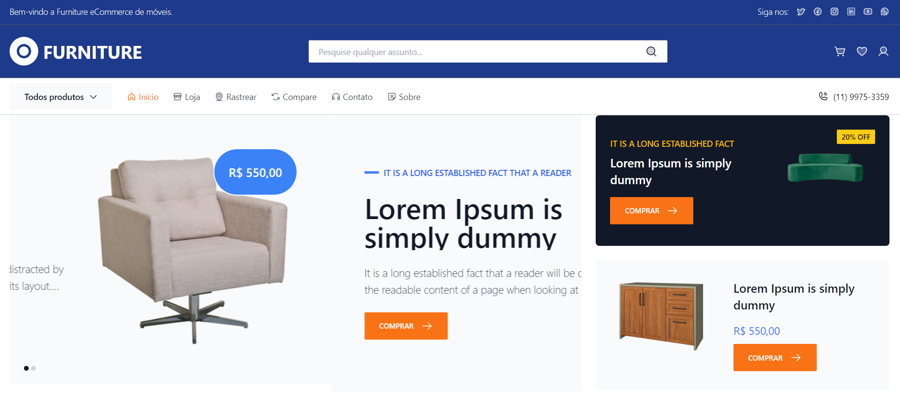

# :desktop_computer: Furniture First Release Application

## :fire: Run

- Development (Port 3000): `yarn dev`

## :triangular_flag_on_post: Environment Variables

### Web Variables

- Environment: `VITE_NODE_ENV` ['mock'|'develop'|'production']
- Bearer Token: `VITE_SERVER_BEARER`

TODO:
  - app/pages/public/store:
    -> Consertar seletor de preço do filtro lateral
    -> Consertar categorias filhas do filtro lateral

  - app/components/form/public/auth:
    -> TextLabel está com problema de controle de valores
